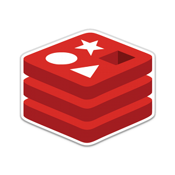
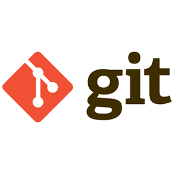

## Hi there 👋, I'm [Wesley](https://wesleymendes.com), a Software Engineer 🚀 from Brazil!

**Talking about Personal Stuffs:**

- 💻 I’m currently working on [Atados](https://github.com/atados);
- 🌱 I’m currently learning [Go](https://www.youtube.com/playlist?list=PLCKpcjBB_VlBsxJ9IseNxFllf-UFEXOdg) and [Kubernetes](https://kubernetes.io/);
- 👯 I'm looking to collaborate on open source projects;
- 💬 Ask me about anything, I am happy to help;
- 📫 How to reach me: [Telegram](https://t.me/wesgtox);
- 😄 Pronouns: he/his;

**Languages and Tools:**  

<code></code>
<code></code>
<code></code>
<code></code>
<code></code>
<code></code>
<code></code>
<code></code>
<code></code>
<code></code>
<code></code>
<code></code>
<code></code>
<code></code>
<code></code>
<code></code>
<code></code>
<code></code>
<code></code>

---

